# Sloth

> **Delegate outcomes, not unlimited access.**

[](LICENSE)
[](https://webmcp.devpost.com/)
[](#local-development--testing)
[](https://sloth-webmcp.vercel.app)

**Sloth** is a payment-operations sandbox and reference architecture for the [WebMCP Challenge](https://webmcp.devpost.com/). It demonstrates a safer operating model for autonomous AI agents: **Just-in-Time Scoped Authority**.

Instead of granting an agent permanent financial access or forcing a human to micro-approve every single operation, Sloth starts with four read-only and pre-authorized tools. The agent investigates independently, identifies duplicate charges, and requests narrow, temporary capability. Once a human reviews and adjusts the grant, a fifth tool—`refund_scoped_transactions`—is dynamically registered into the browser's WebMCP runtime. Scope is strictly enforced **inside the tool handler** (with dual transaction and aggregate caps plus a 60-second self-expiring TTL). When the outcome is delivered, the tool is completely unregistered.

---

### Quick Navigation

- 🌐 [Live Production Console](https://sloth-webmcp.vercel.app)
- 🏆 [Devpost Hackathon Submission](https://webmcp.devpost.com/)
- 🎥 [3-Minute Video Walkthrough](https://youtu.be/) *(Demo Walkthrough)*
- 📐 [Architecture & Dynamic Lifecycle](#architecture--the-scoped-authority-lifecycle)
- 🛠️ [Tool Contracts & Schemas](#tool-contracts--schemas)
- 🧭 [Judge Verification Guide (Dual-Track)](#judge-verification-guide)
- 🏢 [Enterprise Impact & Generalization](#enterprise-impact-the-scoped-authority-pattern)
- 💻 [Local Development & Testing](#local-development--testing)

---

## The Problem: The Agent Privilege Dilemma

Current autonomous agent deployments fail on safety in one of two opposite extremes:

| Approach | Architecture | Operational Failure |
| :--- | :--- | :--- |
| **Standing Privileges** | Agent holds static API keys with broad mutating tools permanently enabled (e.g. `refund_payment`). | **Critical Risk**: Prompt injection, hallucinations, or loops can drain company funds or corrupt records without friction. |
| **Chat Micromanagement** | Agent stops to ask the human for permission before every single individual action. | **Autonomy Bottleneck**: High notification fatigue; the human becomes a human rubber-stamp, negating the value of automation. |
| **Sloth: Just-In-Time Scoped Authority** | Agent begins with safe inspection tools; requests a narrow, bounded grant only when needed; tool appears dynamically via WebMCP, enforces bounds in code, and automatically revokes. | **Autonomous & Safe**: The human sets the strategic boundary once; the agent executes within that boundary and self-adapts to rejections. |

---

## Architecture & The Scoped Authority Lifecycle

WebMCP enables the browser page's live tool inventory to serve as a **real capability boundary**. An unavailable tool is completely absent from the runtime (`navigator.modelContext` / `document.modelContext`). It cannot be called or discovered until approved, and it disappears when revoked.

```mermaid
sequenceDiagram
    autonumber
    actor Human as Human Ops Lead
    participant WebMCP as WebMCP Runtime (Browser)
    participant Agent as Autonomous Agent
    participant Engine as Scope Policy Engine

    Note over WebMCP: Baseline State (04 Tools)
    Agent->>WebMCP: inspect_issues() & inspect_transaction()
    WebMCP-->>Agent: 14 issues, 3 confirmed duplicate charges
    Agent->>WebMCP: retry_payment({ id: "PAY-17" })
    WebMCP-->>Agent: Idempotent retry queued (pre-authorized policy)

    rect rgb(30, 35, 25)
    Note over Agent, Human: Capability Boundary Reached
    Agent->>WebMCP: request_capability({ capability: "refund_scoped_transactions", scope: { tx: ["TX-48","TX-72","TX-184"], maxAmount: 184 }, reason: "Duplicate charges" })
    WebMCP->>Human: Render Approval Card from Agent Payload
    Human->>Human: Adjust cap: $184 → $72 (Per-item) & $100 (Aggregate)
    Human->>WebMCP: Approve Grant
    end

    Note over WebMCP: Dynamic Tool Registration (05 Tools Active · 60s TTL)
    WebMCP-->>Agent: refund_scoped_transactions available

    rect rgb(35, 30, 25)
    Note over Agent, Engine: In-Tool Scope Enforcement & Adaptation
    Agent->>Engine: refund_scoped_transactions({ tx: [{ id: "TX-999", amount: 220 }] })
    Engine-->>Agent: SCOPE_VIOLATION (TRANSACTION_NOT_ALLOWED, AMOUNT_OVER_GRANT)
    Agent->>Agent: Parse error & adaptively prune out-of-scope transactions
    Agent->>Engine: refund_scoped_transactions({ tx: [{ id: "TX-48", amount: 48 }, { id: "TX-72", amount: 72 }] })
    Engine-->>Agent: Success: $120 refunded (TX-184 deferred under cap)
    end

    rect rgb(25, 25, 30)
    Note over Human, WebMCP: Automatic or Explicit Revocation
    alt Run Completed
        Human->>WebMCP: End run & revoke authority
    else 60s TTL Expires
        WebMCP->>WebMCP: Automatic capability unregistration
    end
    Note over WebMCP: Return to Baseline (04 Tools Active)
    end
```



### State Machine Lifecycle

```
[ INITIAL STATE ]
   Rail: 04 Tools (inspect_issues, inspect_transaction, retry_payment, request_capability)
   Findings: Empty (— / — / —)
        │
        ▼ (Tool Call: inspect_issues)
[ INVESTIGATING ]
   Findings Revealed: 14 Issues · 03 Confirmed Duplicates
   Safe Retries: Pre-authorized failure allowlist enforced
        │
        ▼ (Tool Call: request_capability)
[ BOUNDARY REQUEST ]
   Payload: Exact IDs, Max Amount, and Contextual Reason
   Human Action: Allow, Adjust, or Deny
        │
        ▼ (Human Grant: Adjusted to $72)
[ SCOPED AUTHORITY ACTIVE ]
   Rail: 05 Tools (refund_scoped_transactions dynamically registered)
   Safety Bounds: Per-item Cap ($72) · Aggregate Cap ($100) · 60s Countdown TTL
        │
        ▼ (Tool Call: refund_scoped_transactions)
[ ENFORCED EXECUTION ]
   Out-of-Scope Call: Rejected with structured SCOPE_VIOLATION
   Adaptation: In-scope charges refunded ($48 + $72); $184 charge deferred
        │
        ▼ (Explicit Completion OR 60s TTL Expiry)
[ CAPABILITY REVOKED ]
   Rail: 04 Tools (refund tool unregistered from WebMCP)
   Audit Trail: Structured JSON ledger ready for export
```

---

## Tool Contracts & Schemas

Sloth strictly enforces schemas and tool availability contracts at runtime:

| Tool | Availability | Mutation | Contract & Guardrail |
| :--- | :--- | :--- | :--- |
| `inspect_issues` | Always | Read-only | Returns issue summaries and unresolved work. Findings remain masked in the UI until called. |
| `inspect_transaction` | Always | Read-only | Returns detailed metadata for a single transaction ID. |
| `retry_payment` | Always | Constrained Mutation | Idempotent, pre-authorized mutation. Accepts only inspected failed IDs (e.g. `PAY-17`). Arbitrary IDs (e.g. `TX-48`) trigger `PREAUTHORIZED_POLICY_VIOLATION`. |
| `request_capability` | Always | Policy Request | Dynamic capability request. The payload is the sole source of truth for the human approval card. |
| `refund_scoped_transactions` | **Granted Run Only** | High-Impact Mutation | Dynamically registered upon approval. Enforces immutable approved IDs, per-transaction cap, aggregate cap, and positive numeric amounts. Unregistered on finish or 60s TTL expiry. |

### Schema: `request_capability` Payload

The capability request establishes the exact scope the agent is asking for:

```json
{
  "capability": "refund_scoped_transactions",
  "scope": {
    "transactions": ["TX-48", "TX-72", "TX-184"],
    "maxAmount": 184,
    "maxTotalAmount": 304
  },
  "reason": "Confirmed duplicate charges across payment batches"
}
```

### Schema: Structured `SCOPE_VIOLATION` Response

When an agent attempts an out-of-scope operation, the tool rejects it with machine-readable, actionable violations that allow autonomous recovery:

```json
{
  "ok": false,
  "error": {
    "code": "SCOPE_VIOLATION",
    "message": "Refund call is outside the temporary authority grant.",
    "allowedTransactions": ["TX-48", "TX-72"],
    "maxAmountPerTransaction": 72,
    "maxTotalAmount": 100,
    "rejected": [
      {
        "id": "TX-999",
        "amount": 220,
        "violations": ["TRANSACTION_NOT_ALLOWED", "AMOUNT_OVER_GRANT"]
      }
    ]
  }
}
```

---

## Judge Verification Guide

Sloth provides two deterministic evaluation tracks.

### Track A: Native WebMCP & Tool Inspector (Recommended)

Requires Chrome 149+ with `chrome://flags/#enable-webmcp-testing` enabled or the official [Google Model Context Tool Inspector extension](https://chromewebstore.google.com/detail/model-context-tool-inspec/gbpdfapgefenggkahomfgkhfehlcenpd).

1. Open `https://sloth-webmcp.vercel.app` in Chrome. Confirm the header reads **`WebMCP / Native tools online`**.
2. **Verify initial tool surface**: Open DevTools Console or the Inspector. Check tools:
   ```javascript
   await document.modelContext.getTools();
   // Returns exactly 4 baseline tools. refund_scoped_transactions does NOT exist.
   ```
3. **Execute investigation**:
   ```javascript
   await document.modelContext.executeTool("inspect_issues", {});
   // UI unmasks findings: 14 reviewed issues, 3 confirmed duplicates.
   ```
4. **Test pre-authorized mutation policy**:
   ```javascript
   await document.modelContext.executeTool("retry_payment", { id: "PAY-17" });
   // Returns: { ok: true, status: "retry_queued" }

   await document.modelContext.executeTool("retry_payment", { id: "TX-48" });
   // Returns: { ok: false, error: { code: "PREAUTHORIZED_POLICY_VIOLATION" } }
   ```
5. **Request temporary capability**:
   ```javascript
   await document.modelContext.executeTool("request_capability", {
     capability: "refund_scoped_transactions",
     scope: { transactions: ["TX-48", "TX-72", "TX-184"], maxAmount: 184 },
     reason: "Confirmed duplicate charges"
   });
   // UI renders the human approval card directly from this payload.
   ```
6. **Adjust and approve**: In the console UI, adjust the limit slider to `$72` and click **Approve Scope**.
7. **Verify dynamic tool registration (4 → 5 tools)**:
   ```javascript
   const tools = await document.modelContext.getTools();
   console.log(tools.length); // 5
   // refund_scoped_transactions is now registered with active 60s TTL!
   ```
8. **Test boundary rejection**:
   ```javascript
   await document.modelContext.executeTool("refund_scoped_transactions", {
     transactions: [{ id: "TX-999", amount: 220 }]
   });
   // Returns structured SCOPE_VIOLATION. The call is blocked inside the tool handler.
   ```
9. **Execute valid in-scope refund**:
   ```javascript
   await document.modelContext.executeTool("refund_scoped_transactions", {
     transactions: [{ id: "TX-48", amount: 48 }, { id: "TX-72", amount: 72 }]
   });
   // Succeeds. TX-184 remains untouched.
   ```
10. **Revoke and confirm cleanup (5 → 4 tools)**: Click **End run & revoke authority** (or let the 60s TTL expire).
    ```javascript
    const finalTools = await document.modelContext.getTools();
    console.log(finalTools.length); // 4 (refund tool completely removed)
    ```

### Track B: 1-Click Interactive Console Evaluation

If evaluating in a standard browser without WebMCP flags:

1. Visit `https://sloth-webmcp.vercel.app`.
2. Click **Start delegated run** (or **Replay demo path**).
3. Observe live metric reveal: investigation counts unmask only as each tool executes (`14` issues, `03` duplicates, `01` retry).
4. Inspect the pending Capability Request card generated from the agent payload.
5. Use the range slider to adjust the cap to **$72** and click **Approve scope**.
6. Note the dynamic authority rail transition from `04` to `05`, active grant strip, and the live 60-second TTL countdown timer.
7. Click **Test an out-of-scope call**: observe the structured `SCOPE_VIOLATION` JSON block returned by the engine.
8. Click **Execute verified refunds**: observe successful settlement of `$48` and `$72` while `$184` is automatically deferred.
9. Click **Fast-forward ⚡** to simulate TTL expiration or click **End run & revoke authority** to remove the tool.
10. Click **Export Audit Ledger (.json)** to inspect the complete, tamper-evident record of all agent interactions and scope decisions.

---

## Enterprise Impact: The Scoped Authority Pattern

While demonstrated on payment operations, Sloth's architecture directly solves the AI privilege problem across critical enterprise verticals:

```
                  ┌────────────────────────────────────────────────────────┐
                  │                 SLOTH PATTERN ENGINE                   │
                  │  Baseline Tools ──► Scope Request ──► Dynamic Grant    │
                  │        ▲                                   │           │
                  │        └───────── Revoke on TTL ───────────┘           │
                  └──────────────────────────┬─────────────────────────────┘
                                             │
         ┌───────────────────────────────────┼───────────────────────────────────┐
         ▼                                   ▼                                   ▼
┌──────────────────┐               ┌──────────────────┐                ┌──────────────────┐
│   CLOUD DEVOPS   │               │ FINTECH & BANKING│                │ HEALTHCARE / CRM │
│ Temporary SSH    │               │ Scoped refunds & │                │ Ephemeral access │
│ & DB migrations  │               │ chargeback fixes │                │ to audited files │
└──────────────────┘               └──────────────────┘                └──────────────────┘
```

- **Cloud Infrastructure & DevOps**: Rather than giving an AI agent persistent SSH keys or broad AWS IAM permissions, the agent investigates an incident with read-only metrics, requests temporary write access to a single ECS service or Kubernetes namespace, executes the restart, and loses access immediately upon verification.
- **Fintech & Banking Operations**: Tier-1 customer support agents can investigate disputed transactions independently, but must secure human sign-off for financial movement. The human sets the financial boundary (e.g. max $100 across 2 specific accounts), and the agent executes within that boundary.
- **Healthcare & Regulated Records**: Autonomous assistants can access anonymized medical catalogs, requesting temporary scoped access to an individual patient record only upon verified clinician hand-off, backed by exportable compliance audit ledgers.

---

## Local Development & Testing

### Prerequisites
- Node.js 22.13+
- npm 10+

### Setup

```powershell
# Clone the repository
git clone https://github.com/emmaGH1/sloth.git
cd sloth

# Install dependencies
npm ci

# Run the automated test suite
npm test

# Launch the development server
npm run dev
```

### Production Build

Sloth is built with Next.js and vinext for rapid static generation and client hydration:

```powershell
npm run build
```

### Test Suite Overview

The project maintains 17 comprehensive unit tests in [`tests/scope.test.mjs`](tests/scope.test.mjs):
- Scope request parsing, unbounded request rejection, and malformed payload validation.
- In-tool boundary enforcement, amount-over-grant detection, and aggregate cap bounds.
- Structured `SCOPE_VIOLATION` and `PREAUTHORIZED_POLICY_VIOLATION` error shapes.
- 4 → 5 → 4 dynamic registration lifecycle verification.
- Delayed investigation findings unmasking and idempotent retry accounting.

```
✔ accepts and preserves a valid capability request scope
✔ rejects unsupported, unverified, duplicate, or unbounded capability requests
✔ allows the three specifically approved duplicate refunds
✔ rejects an unapproved transaction with a structured scope error
✔ rejects a verified transaction omitted from the active grant
✔ rejects an approved transaction when its amount exceeds the human limit
✔ rejects empty batches
✔ rejects duplicate transaction IDs to prevent double refunds
✔ rejects non-positive amounts and refunds over the original charge
✔ rejects numeric strings and non-finite amounts
✔ plans only refunds covered by an adjusted authority cap
✔ retry policy accepts inspected failures and rejects arbitrary payments
✔ investigation findings stay empty until the matching tool runs
✔ inspect_issues reveals reviewed issues and confirmed duplicates
✔ inspect_transaction and successful retries accumulate only after those calls
✔ rejects a refund batch that breaches the aggregate run cap
✔ plans refunds bounded by both per-item cap and aggregate cap

17 tests passing (0 failures)
```

---

## License & Compliance

Distributed under the **MIT License**. See [`LICENSE`](LICENSE) for details.

*Disclaimer: Sloth is an architectural sandbox and capability-policy prototype built for the WebMCP Challenge. It does not connect to real banking networks, move real funds, or store production customer data.*
