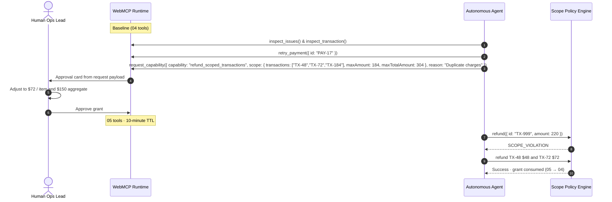

# Sloth

> **Delegate outcomes, not unlimited access.**

[](LICENSE)
[](https://webmcp.devpost.com/)
[](https://sloth-webmcp.vercel.app)

**Sloth** is a payment-operations sandbox for the [WebMCP Challenge](https://webmcp.devpost.com/). An agent starts with four baseline tools, investigates, then asks for one temporary refund capability. The human can allow, adjust, or deny. Scope is enforced **inside the tool**, then the tool is removed.

Not a production processor. No real funds, auth, or customer data. “Sloth” is a working name only.

## Live

- App: https://sloth-webmcp.vercel.app
- Repo: https://github.com/emmaGH1/sloth.git (MIT)

## Canonical prompts

Use the outcome, not a script of tool calls.

**ChatGPT / natural-language agent**

```
Clean up today’s payment problems. Only bother me when you actually need my authority.
```

**Inspector / explicit evaluation prompt**

```
Inspect today's payment issues, retry any pre-authorized failures, and request narrow capability to refund confirmed duplicate charges up to the verified amounts.
```

## Architecture

WebMCP makes the page’s live tool inventory the authorization boundary. `refund_scoped_transactions` does not exist until a human grant registers it, and it is unregistered on consume, deny, end, or TTL expiry.



## Tool contracts

| Tool | When | Contract |
| --- | --- | --- |
| `inspect_issues` | Always | Read-only issue summary. UI counts stay `—` until called. |
| `inspect_transaction` | Always | Read-only lookup by ID. |
| `retry_payment` | Always, pre-authorized | Failed IDs only (`PAY-17` ok, `TX-48` → `PREAUTHORIZED_POLICY_VIOLATION`). |
| `request_capability` | Always | Payload is the approval-card source of truth: `transactions`, `maxAmount`, `maxTotalAmount`, `reason`. After deny, further requests return `DO_NOT_RETRY`. |
| `refund_scoped_transactions` | After human grant | Immutable IDs, per-item cap, aggregate cap (including spend from earlier calls). Out of scope → `SCOPE_VIOLATION`. Unregistered after an in-scope success, End run, deny, or TTL expiry. |

### `request_capability` payload

```json
{
  "capability": "refund_scoped_transactions",
  "scope": {
    "transactions": ["TX-48", "TX-72", "TX-184"],
    "maxAmount": 184,
    "maxTotalAmount": 304
  },
  "reason": "Confirmed duplicate charges across payment batches"
}
```

The approval card renders this payload. Adjusting the sliders changes the grant that is later enforced; it does not invent a hidden 150/304 threshold.

## Judge verification

Header must read **`WebMCP / Native Live`** for native proof, or **`WebMCP / Simulation`** for the labelled fallback.

### Track A — Native WebMCP

Chrome 149+ with `chrome://flags/#enable-webmcp-testing`, or the [Model Context Tool Inspector](https://chromewebstore.google.com/detail/model-context-tool-inspec/gbpdfapgefenggkahomfgkhfehlcenpd), or ChatGPT’s in-app browser.

1. Confirm four tools. `refund_scoped_transactions` is absent. Rail `04`.
2. `inspect_issues` → counts `14` / `03`.
3. `retry_payment` `{ "id": "PAY-17" }` succeeds; `{ "id": "TX-48" }` is blocked.
4. `request_capability` with the payload above. The card shows `$184` / item and `$304` aggregate.
5. Click **Adjust**, set per-item **$72** and aggregate **$150**, then **Confirm revised grant**. Rail `05`. TTL starts at **10:00**.
6. Refund `{ "id": "TX-999", "amount": 220 }` → `SCOPE_VIOLATION`. Grant remains.
7. Refund TX-48 `$48` and TX-72 `$72`. TX-184 stays untouched. Grant is consumed; rail returns to `04`.
8. Optional: **Export audit (.json)** is a client-side run record, not a signed ledger.

### Track B — Console replay (no WebMCP)

1. Click **Launch Delegated Run** (or **Trigger Delegated Run** in the console).
2. Counts unmask as the replay runs: `14` issues, `03` duplicates, `01` retry.
3. **Adjust** to **$72** / item and **$150** aggregate, then **Confirm revised grant** (or **Allow this scope** to keep the requested `$184` / `$304`).
4. Boundary buttons call the same validator as the tool. The activity log reports the **actual** result for the active grant — they will not reject a call the grant allows.
5. **Execute verified refunds (single-use)** refunds in-scope items and removes the tool.
6. **Fast-forward** expires a live grant. After a successful refund the grant is already gone, so Fast-forward is hidden.
7. **End run & revoke authority** or **Re-arm Console** from a terminal state.

## Local

Node 22.13+.

```powershell
npm ci
npm test
npm run dev
```

`npm run build` is the ChatGPT Sites / vinext bundle.

Unit tests cover request validation (including `maxTotalAmount`), refund planning, per-item and aggregate enforcement, cumulative spend, and consume-on-success policy. They do not drive the browser WebMCP registry; 4 → 5 → 4 is verified on the live rail / Inspector.

## License

MIT. See [`LICENSE`](LICENSE).
